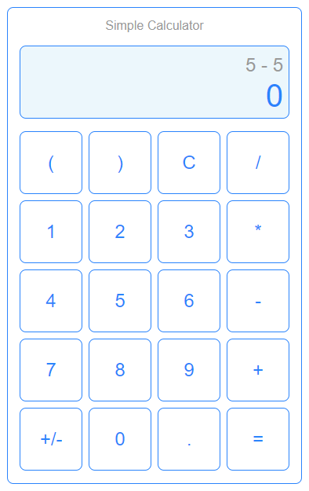

# Simple Calculator

This is a simple GUI calculator app.

In this example, we tried using Grid layout for our app. This is the layout of the app.

To create the UI that matches the above picture, we need to set the button size (`width` and `height`) to form a square. `height` option for buttons is not supported in either `ttk` module nor `ttkbootstrap` module, hence we use the basic `tkinter` module in this example.