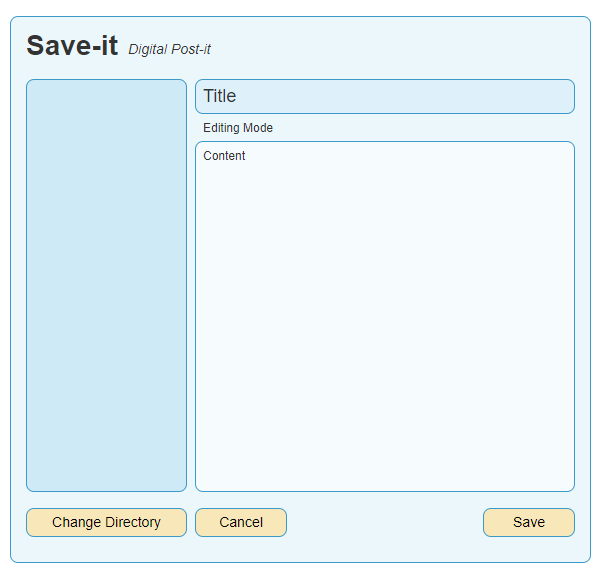
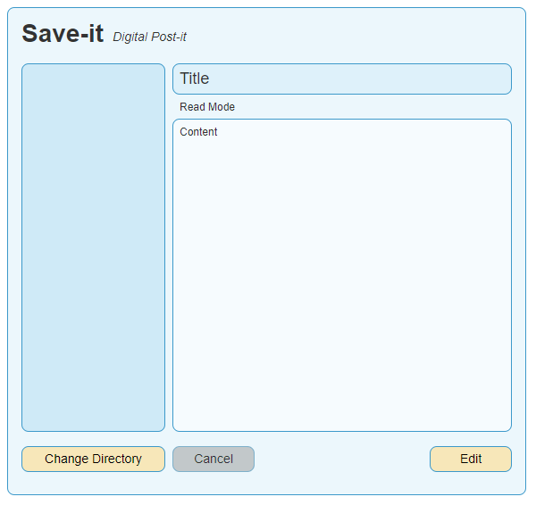

# Save-it! (Sticky notes... kinda)

This is an example of something that resembles sticky notes app.
The app has the same function as sticky notes, but works in a more traditional computer way.

This app works by treating each sticky note as a single `.txt` file.
The app will prepare a folder to keep all the sticky notes you create and keep track of all `.txt` file inside of it.
You may choose other directory to work with.
This app will automatically detect all `.txt` file within the directory.

## Key Feature

Write and read files. You can create sticky notes, read existing ones and also edit it.
You can also choose the directory to work with.

## Layout

In this example, we are using `customtkinter` for styling. We are using the default linear layout and it goes like these images below.

## Disclaimer

I understand that this might not be the best example of an app.
However, I think that this is the easiest stuff to come up with for learning file handling for Python desktop GUI apps.
So, please don't think too much of this app as a whole.