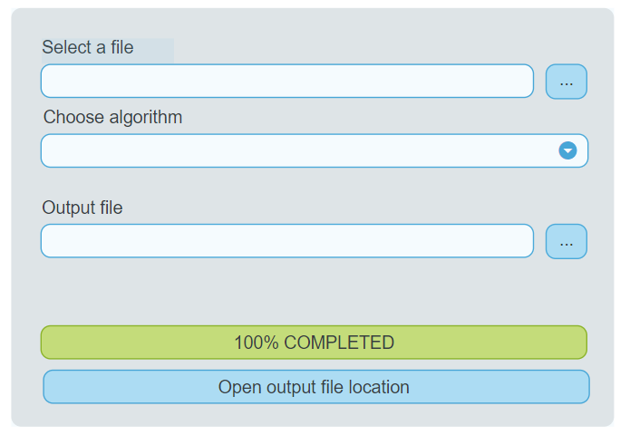

# App Simulator

This is a simple app to simulate a complete workflow of an app.

# App Workflow

- User will meet a GUI layout that look something like the image below.

- User need to select a file from their file explorer.
Just for the sake of this example, **any file** is fine.
(Relax, nothing is going to happen to your file. We just copied the path to it.)
- User may select from options of algorithm to choose.
- User need to set a file name and target output directory.
- Click the *PROCESS* button and the app will start simulating work.
- After simulation finished, a simple `.txt` file will emerge with the filename and path you have chosen.